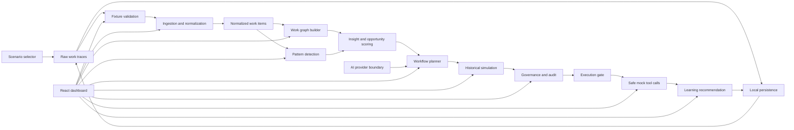

# 2. Architecture

## 2.1 Architecture Summary

Work Graph Foundry is implemented as a local-first browser MVP. React renders the dashboard, while TypeScript domain modules perform the product logic. There is no backend in the current MVP because the demo uses local fixtures, browser-local persistence, safe mock execution, and deterministic provider behavior.

This architecture keeps the solution easy to run, easy to test, and easy for a new developer or agent to inspect.

## 2.2 Component Diagram

## 2.3 Source Components

### 2.3.1 Dashboard

`src/App.tsx` orchestrates the demo state and renders the product panels.

Current React state:

- `sampleLoaded`: whether fixture data has been loaded.
- `selectedScenarioId`: the active synthetic scenario.
- `analysisRequested`: whether ingestion, graphing, and pattern detection have run.
- `proposalRequested`: whether a governed proposal has been generated.
- `governanceDecision`: pending, approved, rejected, or changes requested.
- `runRequested`: whether the user has attempted safe mock execution.

Derived data is calculated from these states and persisted to local storage with generated graph, proposal, simulation, governance, execution, recommendation, and audit snapshots. The dashboard intentionally keeps the flow visible instead of hiding it behind a chat interface.

### 2.3.2 Fixture Loading

`src/domain/fixtures.ts` loads and validates scenario data from `src/fixtures/demoData.ts`.

It checks:

- duplicate trace ids
- missing trace text
- missing department metadata
- cases without approval history
- policy rules with no request types
- incomplete incoming request data

### 2.3.3 Ingestion

`src/domain/ingestion.ts` groups raw traces by case id and creates normalized work items.

This module converts messy source signals into structured fields that later modules can trust.

### 2.3.4 Graph Builder

`src/domain/graph.ts` creates a graph with:

- requester
- manager approval
- policy check
- system action
- audit log
- exception review
- outcome

It also calculates graph metrics:

- average cycle time
- exception rate
- approval delay

### 2.3.5 Pattern Detection

`src/domain/patterns.ts` groups normalized items by request type and scores automation opportunity.

The scoring considers:

- volume
- repeatability
- approval delay
- risk adjustment

### 2.3.6 Planner

`src/domain/planner.ts` generates a typed `AutomationProposal`.

The proposal includes:

- trigger
- required data
- eligibility rules
- policy checks
- actions
- escalations
- confidence
- risk level
- expected value
- audit rationale
- version

### 2.3.7 Simulation

`src/domain/simulation.ts` replays historical cases against a proposal.

Outcomes:

- `pass`
- `fail`
- `needs_human`
- `policy_risk`

Simulation is the proof step before governance approval.

### 2.3.8 Governance

`src/domain/governance.ts` creates governance records, audit events, and execution gate checks.

Execution only opens when an approval exists for the proposal id and version.

### 2.3.9 Execution And Learning

`src/domain/execution.ts` runs approved workflows through mock tools and creates learning recommendations.

Mock tools:

- `employee-directory.validate`
- `policy-catalog.evaluate`
- `work-orchestrator.create-task`
- `audit-log.write`

No real enterprise system is called.

### 2.3.10 AI Provider Boundary

`src/ai/providers.ts` defines:

- `AiProvider`
- `MockAiProvider`
- `OpenAiResponsesProvider`

The mock provider is the default. The OpenAI provider is a boundary for future trusted server-side integration.

### 2.3.11 Scenario And Persistence

`src/domain/fixtures.ts` exposes:

- `listDemoScenarios()`
- `loadDemoScenario(scenarioId)`
- `loadDemoFixtures()` for the default IT access scenario

`src/domain/persistence.ts` owns browser-local demo state:

- selected scenario
- staged operator flags
- generated graph
- proposals
- governance records
- simulation result
- execution runs
- learning recommendations
- audit events

The app persists these snapshots to `localStorage` under a versioned key. Reset returns the selected scenario to a deterministic seeded baseline.

## 2.4 Data Flow

The data flow is strictly ordered:

1. `loadDemoScenario(scenarioId)`
2. `validateDemoFixtures(fixtures)`
3. `ingestWorkTraces(rawTraces, approvalHistory)`
4. `buildWorkGraph(items)`
5. `detectWorkPatterns(items)`
6. `generateAutomationProposal(context)`
7. `simulateAutomation(proposal, items)`
8. `createGovernanceRecord(...)`
9. `canExecute(records, proposal)`
10. `runApprovedWorkflow(...)`
11. `recommendLearningUpdate(...)`
12. `saveDemoState(snapshot)`

Do not skip earlier stages when adding features. Later stages assume earlier contracts are valid.

## 2.5 Agent Behavior

The MVP models agents as deterministic modules:

- Observer agent: ingestion and normalization.
- Mapper agent: graph building.
- Analyst agent: pattern detection and bottleneck reasoning.
- Planner agent: proposal generation.
- Simulator agent: historical replay.
- Governance agent: approval and audit gate.
- Executor agent: safe mock tool calls.
- Learner agent: improvement recommendation.

This approach keeps behavior deterministic for demos and tests while preserving the agentic product shape.

## 2.6 UI Architecture

The dashboard includes:

- demo controls
- scenario selector
- operator checklist
- scripted demo path
- system status metrics
- ingestion summary
- raw-to-normalized evidence
- work graph
- pattern detection
- bottleneck insight
- proposal panel
- simulation panel
- governance approval
- execution and learning loop
- persisted audit trail
- run summary import/export

The layout is responsive and avoids marketing-style hero content.

## 2.7 Why There Is No Backend Yet

The current MVP does not need a backend because:

- data is local
- execution is mocked
- there is no authentication
- persistence is browser-local and does not require a server
- live OpenAI calls are optional and not used by browser default

Add a backend when implementing:

- live OpenAI calls
- enterprise connectors
- persistent audits
- real users and roles
- real tool execution

## 2.8 Future Production Architecture

A production version should split responsibilities:

- React dashboard for operators and reviewers.
- API service for traces, proposals, simulation, governance, execution, and model calls.
- Database for traces, normalized items, graphs, proposals, audit events, and execution runs.
- Connector workers for source systems.
- Tool execution service with allowlists.
- Observability layer for model calls, policy overrides, simulation drift, and execution failures.

The current contracts are designed to be lifted into that architecture.
