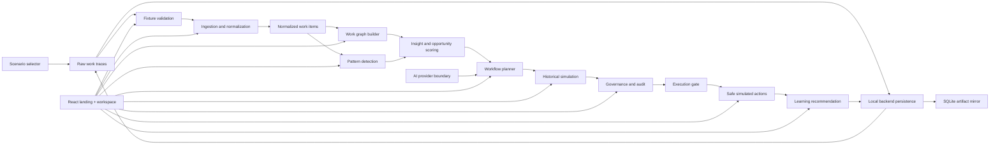

# 2. Architecture

## 2.1 Architecture Summary

Samruna is implemented as a local-first full-stack POC - Proof Of Concept. React renders a landing-first product page and a path-backed POC - Proof Of Concept workspace, while a local TypeScript backend owns workspace state, SQLite persistence, API envelopes, seed/reset, import/export, and audit retrieval. Shared TypeScript domain modules still perform the deterministic product logic.

This architecture keeps the solution easy to run, easy to test, and easy for a new developer or agent to inspect.

## 2.2 Component Diagram

## 2.3 Source Components

### 2.3.1 Frontend Shell

`src/App.tsx` is the composition root. It creates the POC - Proof Of Concept controller, renders the customer-facing landing page at `/`, opens the interactive workspace at `/dashboard`, owns the local active view state, and renders `src/app/AppShell.tsx` plus the selected feature view.

The frontend is split into:

- `src/app/useWorkGraphDemoController.ts`: POC - Proof Of Concept state, derived workflow data, persistence snapshot, and workflow actions.
- `src/app/navigation.ts`: menu metadata and the `ViewId` union.
- `src/App.tsx`: landing page, `/dashboard` workspace entry, and workspace view composition.
- `src/app/AppShell.tsx`: sidebar navigation, mobile view selector, compact topbar status, progress stepper, scenario selector, workflow controls, and main content region.
- `src/features/overview/OverviewView.tsx`: compact workspace overview, next action, state summary, before/after impact comparison, and collapsible system details.
- `src/features/observe/ObserveView.tsx`: evidence intake, source channels, validation, ingestion, and normalized evidence.
- `src/features/analyze/AnalyzeView.tsx`: graph visualization, elevated graph metrics, graph details, patterns, bottlenecks, and opportunity signals.
- `src/features/review-run/ReviewRunView.tsx`: governed proposal, versions, simulation proof, approval or rejection, execution gate, safe simulated actions, collapsible technical details, success banner, and learning loop.
- `src/features/review/ReviewView.tsx`: audit events, export, import, and recovery controls.

Current React state:

- `sampleLoaded`: whether fixture data has been loaded.
- `selectedScenarioId`: the active synthetic scenario.
- `analysisRequested`: whether ingestion, graphing, and pattern detection have run.
- `proposalRequested`: whether a governed proposal has been generated.
- `governanceDecision`: pending, approved, rejected, or changes requested.
- `runRequested`: whether the user has attempted safe simulated execution.

Derived data is calculated from these states and persisted by the local backend with generated graph, proposal, simulation, governance, execution, recommendation, and audit snapshots. The browser keeps a small local mirror for reload resilience and backend-unavailable fallback. The workspace shell keeps the flow visible without turning the product into a single overloaded dashboard.

### 2.3.2 Fixture Loading

`src/domain/fixtures.ts` loads and validates scenario data from `src/fixtures/demoData.ts`.

It checks:

- duplicate trace ids
- missing trace text
- missing department metadata
- cases without approval history
- policy rules with no request types
- incomplete incoming request data

### 2.3.3 Ingestion

`src/domain/ingestion.ts` groups raw traces by case id and creates normalized work items.

This module converts messy source signals into structured fields that later modules can trust.

### 2.3.4 Graph Builder

`src/domain/graph.ts` creates a graph with:

- requester
- manager approval
- policy check
- system action
- audit log
- exception review
- outcome

Graph, node, and edge identifiers are deterministic and scoped by scenario id plus pattern id. Node ids use typed node kind and stable role names, and edge ids use stable source role, relation, and target role names so persisted selections and exported summaries do not collide across scenarios.

It also calculates graph metrics:

- average cycle time
- exception rate
- approval delay

### 2.3.5 Pattern Detection

`src/domain/patterns.ts` groups normalized items by request type and scores automation opportunity.

The scoring considers:

- volume
- repeatability
- approval delay
- risk adjustment

### 2.3.6 Planner

`src/domain/planner.ts` generates a typed `AutomationProposal`.

The proposal includes:

- trigger
- required data
- eligibility rules
- policy checks
- actions
- escalations
- confidence
- risk level
- expected value
- audit rationale
- version

### 2.3.7 Simulation

`src/domain/simulation.ts` replays historical cases against a proposal.

Outcomes:

- `pass`
- `fail`
- `needs_human`
- `policy_risk`

Simulation is the proof step before governance approval.

### 2.3.8 Governance

`src/domain/governance.ts` creates governance records, audit events, and execution gate checks.

Execution only opens when an approval exists for the proposal id and version.

### 2.3.9 Execution And Learning

`src/domain/execution.ts` runs approved workflows through safe simulated tool calls and creates learning recommendations.

Simulated tools:

- `employee-directory.validate`
- `policy-catalog.evaluate`
- `work-orchestrator.create-task`
- `audit-log.write`

No real enterprise system is called.

### 2.3.10 AI Provider Boundary

`src/ai/providers.ts` defines:

- `AiProvider`
- `MockAiProvider`
- `OpenAiResponsesProvider`

The mock provider implements the default Historical validation engine. The OpenAI provider is activated only by trusted backend configuration through `server/ai.ts`; browser code reads provider status from backend snapshots and does not import the OpenAI-capable provider path.

### 2.3.11 Scenario And Persistence

`src/domain/fixtures.ts` exposes:

- `listDemoScenarios()`
- `loadDemoScenario(scenarioId)`
- `loadDemoFixtures()` for the default IT access scenario

`server/workspace.ts` owns the mutable backend workspace state and reuses `src/domain/persistence.ts` for export/import compatibility. The default SQLite path is `.samruna/samruna.sqlite`, overrideable with `SAMRUNA_DB_PATH`.

The persisted POC - Proof Of Concept state includes:

- selected scenario
- staged operator flags
- generated graph
- proposals
- governance records
- simulation result
- execution runs
- learning recommendations
- audit events

The backend persists these snapshots under a versioned state contract and mirrors generated artifacts into an artifacts table for verification. The browser also writes the same snapshot to `localStorage` as a fallback mirror. Reset returns the selected scenario to a deterministic seeded baseline.

## 2.4 Data Flow

The data flow is strictly ordered:

1. `loadDemoScenario(scenarioId)`
2. `validateDemoFixtures(fixtures)`
3. `ingestWorkTraces(rawTraces, approvalHistory)`
4. `detectWorkPatterns(items)`
5. `buildWorkGraph(items, scenarioId, patternId)`
6. `generateAutomationProposal(context)`
7. `simulateAutomation(proposal, items)`
8. `createGovernanceRecord(...)`
9. `canExecute(records, proposal)`
10. `runApprovedWorkflow(...)`
11. `recommendLearningUpdate(...)`
12. `POST /api/workspace/run`
13. `GET /api/workspace/export`

Do not skip earlier stages when adding features. Later stages assume earlier contracts are valid.

## 2.5 Agent Behavior

The MVP models agents as deterministic modules:

- Observer agent: ingestion and normalization.
- Mapper agent: graph building.
- Analyst agent: pattern detection and bottleneck reasoning.
- Planner agent: proposal generation.
- Simulator agent: historical replay.
- Governance agent: approval and audit gate.
- Executor agent: safe simulated tool calls.
- Learner agent: improvement recommendation.

This approach keeps behavior deterministic for demos and tests while preserving the agentic product shape.

## 2.6 UI Architecture

The menu-based console includes:

- landing page with a code-native product preview, `Launch` CTA, and impact metrics band
- global POC - Proof Of Concept controls and scenario selector in the shell toolbar
- progress stepper for the staged POC - Proof Of Concept path
- Overview view for workspace orientation, next action, state summary, before/after impact, and system details
- Evidence view for scenario evidence, channel counts, fixture validation, ingestion summary, and normalized work item details
- Graph view for hero workflow metrics, the work graph, node inspection, patterns, bottlenecks, and opportunity/risk signals
- Review & Run view for proposal generation, proposal versions, decision proof, approval/rejection, execution, success state, and collapsible technical details
- Audit view for audit trail, run summary export/import, backend state recovery, browser fallback mirror recovery, and reset verification
- Compact topbar status for AI provider and backend sync state

The layout is responsive, landing-first, and avoids cluttered dashboard chrome.

## 2.7 Backend Boundary

The local backend is intentionally POC - Proof Of Concept-grade:

- data remains synthetic and local
- execution remains safe and simulated
- there is no authentication or RBAC
- state persists to local SQLite
- live OpenAI Responses API use is optional, server-side only, and can generate governed proposals plus synthetic execution runs; if the live call fails, the backend falls back to the deterministic Historical validation engine

Production still requires authenticated APIs, scoped connectors, production secret management, immutable audit storage, and real tool-execution controls.

## 2.8 Future Production Architecture

A production version should split responsibilities:

- React dashboard for operators and reviewers.
- API service for traces, proposals, simulation, governance, execution, and model calls.
- Database for traces, normalized items, graphs, proposals, audit events, and execution runs.
- Connector workers for source systems.
- Tool execution service with allowlists.
- Observability layer for model calls, policy overrides, simulation drift, and execution failures.

The current contracts are designed to be lifted into that architecture.
