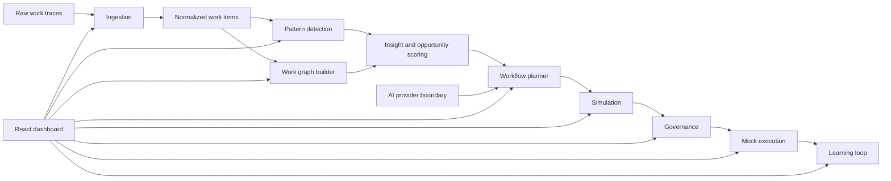

# Architecture

## Overview

Work Graph Foundry is a browser-based local MVP. Domain logic is implemented as TypeScript modules and called directly by the React dashboard. This keeps the demo simple, inspectable, and reliable.

## Core Modules

- `src/domain/fixtures.ts`: loads and validates seeded fixture sets.
- `src/domain/ingestion.ts`: groups raw traces by case and normalizes them into canonical work items.
- `src/domain/graph.ts`: builds workflow nodes, edges, and graph metrics.
- `src/domain/patterns.ts`: groups repeated work patterns and scores bottlenecks/opportunities.
- `src/domain/planner.ts`: generates deterministic governed automation proposals.
- `src/domain/simulation.ts`: replays historical cases against a proposal.
- `src/domain/governance.ts`: creates approval records, execution gates, and audit events.
- `src/domain/execution.ts`: runs approved workflows through safe mock tools and recommends learning updates.
- `src/ai/providers.ts`: defines mock and optional OpenAI provider behavior.

## Data Flow

1. Fixtures provide historical traces, policy rules, approval history, and a new incoming request.
2. Ingestion creates `NormalizedWorkItem` records.
3. Graph and pattern modules derive process structure and bottleneck metrics.
4. Planner creates an `AutomationProposal`.
5. Simulation produces aggregate and case-level replay outcomes.
6. Governance records approval state and audit events.
7. Execution runs only after approval and only through mock tools.
8. Learning recommends a proposal improvement from simulation/execution signals.

## UI Structure

The first screen is the operating dashboard. It includes:

- Demo controls
- Scripted path strip
- System status metrics
- Ingestion summary
- Raw-to-normalized evidence
- Work graph
- Pattern and bottleneck insight
- Automation proposal
- Simulation and governance
- Execution and learning loop

## AI Provider Boundary

The app defaults to `MockAiProvider`. `OpenAiResponsesProvider` exists as a trusted-runtime integration boundary for structured proposal generation. The browser app does not read secrets directly.

Future live model work should introduce a server-side route or API service that owns secret access and calls `OpenAiResponsesProvider`.
