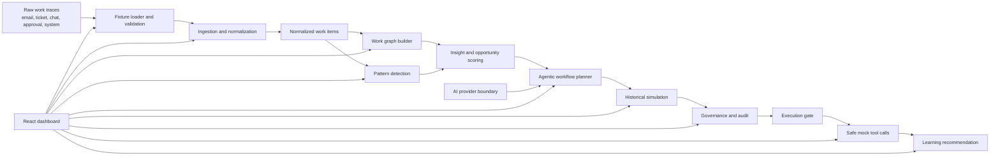

# Architecture Walkthrough

This document explains what Work Graph Foundry is, how the current MVP is implemented, and how the system can evolve into a production enterprise product.

## Solution Overview

Work Graph Foundry is an AI-native enterprise operating layer. The product observes how work moves through an organization, converts messy traces into a live work graph, identifies repeated patterns, and proposes governed automation.

The current MVP demonstrates that loop with IT access requests:

- Work traces come from emails, tickets, chat snippets, approval records, and system actions.
- The system normalizes those traces into canonical work items.
- It builds a graph showing the real process path.
- It detects the repeated workflow and the manager approval bottleneck.
- It generates an automation proposal with policy checks and escalation paths.
- It simulates the proposal against historical cases.
- It requires human approval before execution.
- It runs an approved new request through safe mock tools.
- It recommends an improvement based on exception signals.

## Current Implementation Shape

The app is a local-first browser MVP:

- Frontend: React and TypeScript.
- Build tool: Vite 6.
- Tests: Vitest and Testing Library.
- Data: TypeScript fixture objects.
- Persistence: none yet.
- Backend: none yet.
- Execution: safe mock tools only.
- AI provider: deterministic mock by default, optional OpenAI boundary for trusted runtimes.

This architecture is intentionally simple. It makes the product behavior inspectable and reliable for local demos.

## System Diagram

## Layer By Layer

### 1. Fixture Layer

`src/fixtures/demoData.ts` contains realistic seeded data for the IT access request scenario. It includes:

- Historical request cases.
- Raw traces across multiple channels.
- Policy rules.
- Approval history.
- A new incoming request.

`src/domain/fixtures.ts` validates fixture integrity and produces a summary. This makes the demo data part of the tested product behavior, not just static content.

### 2. Ingestion And Normalization

`src/domain/ingestion.ts` groups raw traces by case and converts them into `NormalizedWorkItem` records.

It extracts or infers:

- requester
- department
- request type
- urgency
- systems
- approver
- timestamps
- policy flags
- exceptions
- outcome
- source trace ids

This is the "observe" phase of the product loop.

### 3. Work Graph

`src/domain/graph.ts` builds a process graph from normalized work items.

Current graph nodes include:

- requester
- manager approval
- policy check
- IT provisioning
- audit log
- exception review
- outcome

Current metrics include:

- average cycle time
- exception rate
- approval delay

This is the "map" phase of the product loop.

### 4. Pattern Detection And Insights

`src/domain/patterns.ts` groups work items by request type and scores them.

The scoring considers:

- volume
- repeatability
- delay
- risk adjustment

The current MVP identifies manager approval as the bottleneck for standard access requests. This is the "understand and reason" phase.

### 5. Workflow Planner

`src/domain/planner.ts` generates a typed `AutomationProposal`.

The proposal includes:

- trigger
- required data
- eligibility rules
- policy checks
- actions
- escalations
- confidence
- risk level
- expected value
- audit rationale
- version

This is the "plan" phase. The output is structured and testable rather than freeform chat text.

### 6. Simulation

`src/domain/simulation.ts` replays historical cases against the proposal.

Each case is classified as:

- `pass`
- `fail`
- `needs_human`
- `policy_risk`

This is the "test before execution" phase. It demonstrates that automation is reviewed against history before being allowed to run.

### 7. Governance And Audit

`src/domain/governance.ts` creates governance records and audit events. Execution is blocked until a matching approval exists for the proposal version.

This layer makes governance a real state transition in the product instead of a decorative UI label.

### 8. Execution And Learning

`src/domain/execution.ts` runs approved workflows through safe mock tool calls.

Current mock tools:

- `employee-directory.validate`
- `policy-catalog.evaluate`
- `it-provisioning.create-task`
- `audit-log.write`

The same module also produces learning recommendations from simulation and execution signals.

## Dashboard Architecture

`src/App.tsx` orchestrates the full demo path in a single operating dashboard. The dashboard is intentionally dense and operational:

- top controls
- scripted demo path
- status metrics
- ingestion summary
- raw-to-normalized evidence
- work graph
- pattern panel
- bottleneck insight
- proposal panel
- simulation and governance panel
- execution and learning panel

The app currently uses local React state. This is enough for the MVP. A production version should move run state, approvals, and audit events into persistent storage.

## AI Provider Architecture

`src/ai/providers.ts` defines:

- `AiProvider`
- `MockAiProvider`
- `OpenAiResponsesProvider`

The mock provider is the default. The OpenAI provider is a boundary for trusted runtimes and uses structured JSON output. The browser app does not read `OPENAI_API_KEY`.

Future production architecture should add:

- server-side API route
- secret management
- request logging
- output validation
- model failure fallback
- evaluation traces

## Why There Is No Backend Yet

The MVP does not need a backend because:

- data is local and deterministic
- execution is mocked
- no auth is implemented
- no persistence is required for the demo
- browser-only logic keeps the walkthrough easy to inspect

Add a backend when the product needs any of these:

- live OpenAI calls with secrets
- enterprise connectors
- persisted audit logs
- user roles
- real execution tools
- deployment

## Current Limitations

- No persistent storage.
- No live enterprise connectors.
- No real provisioning.
- No production RBAC.
- No server-side OpenAI call path yet.
- Graph visualization is a structured panel rather than an interactive graph canvas.

## Production Architecture Direction

A production version should split the app into:

- React dashboard.
- API service for traces, proposals, approvals, execution, and model calls.
- Database for work traces, normalized items, graph snapshots, proposals, simulation results, governance records, audit events, and execution runs.
- Connector workers for enterprise systems.
- Tool execution service with allowlists and approval gates.
- Observability for model calls, drift, overrides, and failed automations.

The MVP already models the contracts and sequence needed for that architecture.
