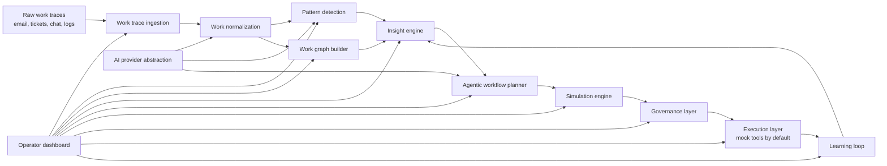

# Architecture

## System Diagram

## Module Responsibilities

- Work trace ingestion: Load raw fixture traces and report source/channel quality.
- Work normalization: Convert messy traces into typed normalized work items.
- Pattern detection: Group similar work items and calculate volume, repeatability, and automation opportunity.
- Work graph builder: Generate nodes, edges, metrics, approval points, policy checks, exceptions, and outcomes.
- Insight engine: Identify bottlenecks, high-risk exceptions, manual effort, and value potential.
- Agentic workflow planner: Produce governed automation specs with triggers, rules, actions, confidence, risk, and escalation paths.
- Simulation engine: Replay historical cases and classify pass, fail, needs human, and policy risk.
- Governance layer: Track approvals, rejections, requested changes, comments, reviewers, and audit events.
- Execution layer: Run approved automations on a new request through safe mock tools.
- Learning loop: Recommend improvements from failures, delays, exceptions, and overrides.

## Data Flow

1. Fixtures provide raw traces for historical requests and one or more new incoming requests.
2. Normalization produces canonical work items.
3. Pattern detection groups work items into process clusters.
4. Graph builder creates a graph for the selected cluster.
5. Insight engine summarizes bottlenecks and opportunity scores.
6. Planner creates an automation proposal.
7. Simulation replays history against the proposal.
8. Governance records review decisions.
9. Execution runs only approved workflows against new requests.
10. Learning loop feeds recommendations back into insights and proposal revision.

## Frontend Structure

The frontend should use a dashboard-first React structure:

- A top-level application shell with demo controls and current scenario state.
- Pattern cluster list and selected-pattern state.
- Graph panel for nodes, edges, metrics, and selected node details.
- Insight, proposal, simulation, governance, execution, and learning panels.
- Compact responsive layout that remains usable on desktop and mobile.

## Local Service Structure

For the MVP, business logic can run in local TypeScript modules imported by the React app. If server behavior is needed, add a lightweight local API only after the client-side flow is proven. The first implementation should avoid unnecessary backend complexity.

## AI Provider Abstraction

Define a provider interface with deterministic mock behavior first. The optional OpenAI provider should use structured JSON outputs and be enabled only when `OPENAI_API_KEY` exists. The UI must show whether mock or live AI is active.

## Extension Points

- Enterprise connectors can replace fixtures later.
- OpenAI-backed classification, extraction, planning, and risk reasoning can replace deterministic mock agents.
- Real provisioning tools can replace safe mock tools once governance and security controls exist.
- Persistent storage can replace in-memory demo state.

